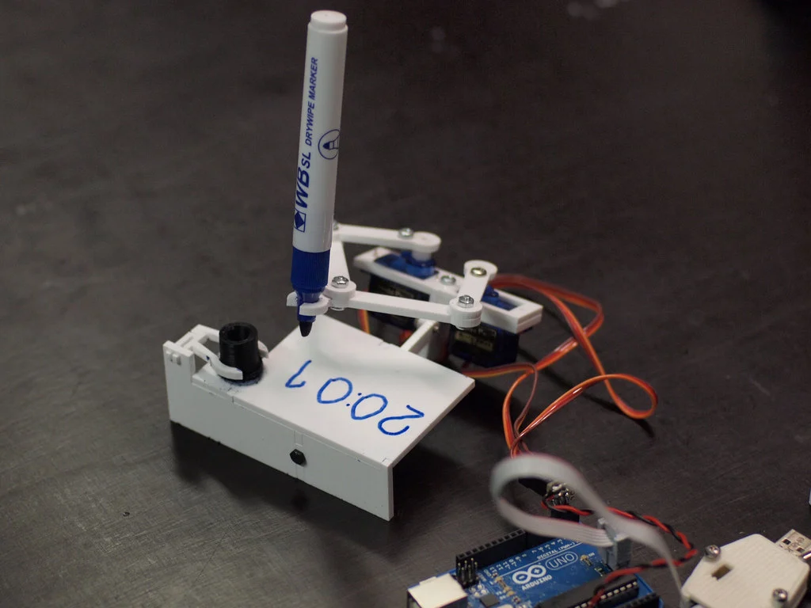
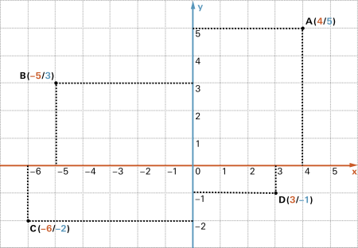
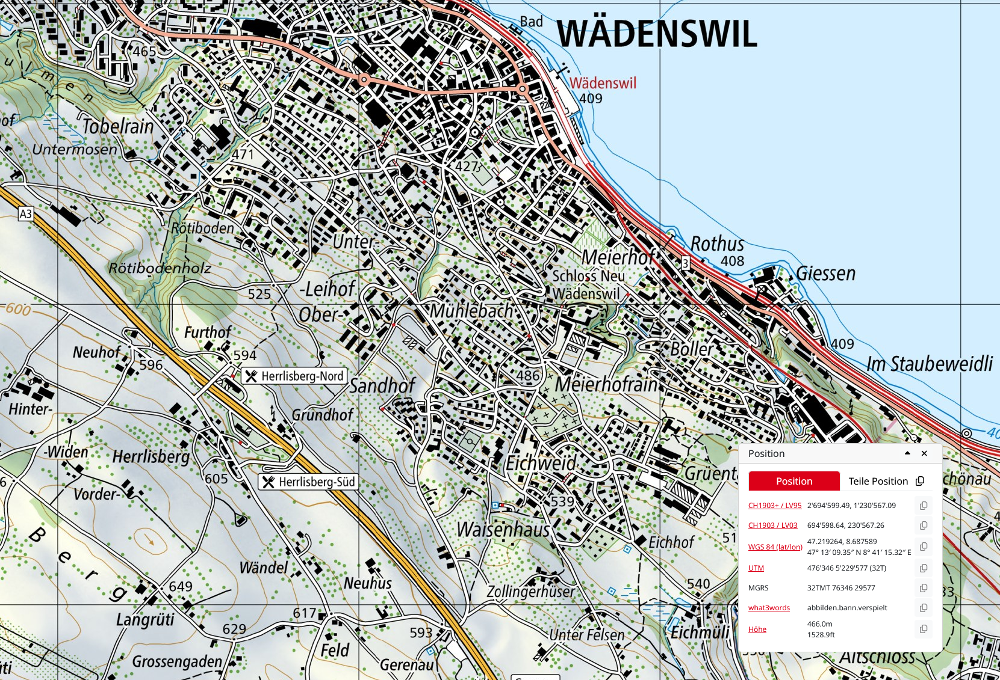
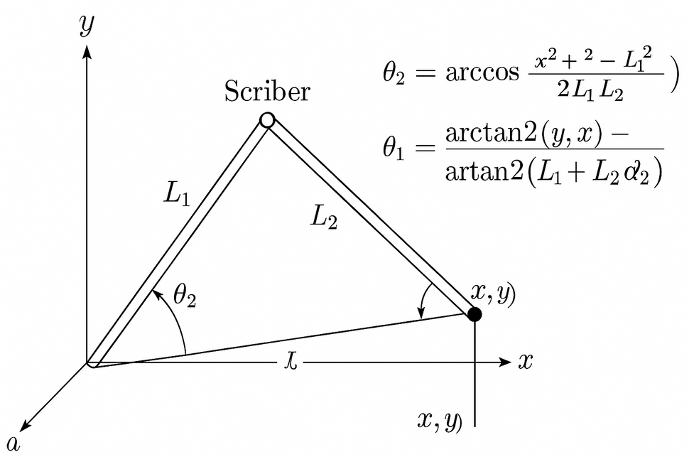
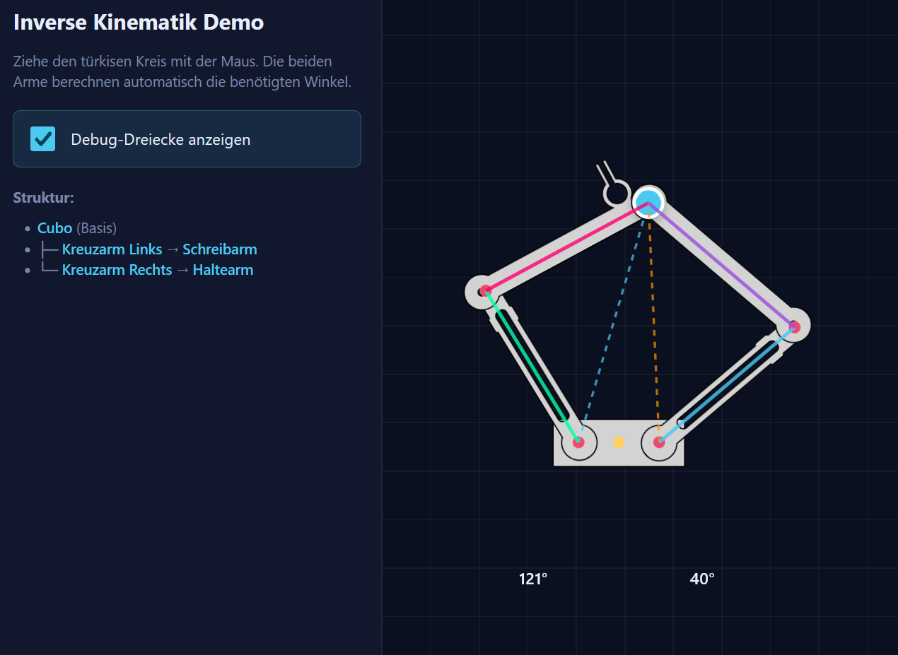

# Zukunftstag2025

Wir bauen einen Schreibroboter. Wir lernen schrittweise, wie wir ihn programmieren und wie wir ihm beibringen können, das zu schreiben, was wir wollen.

## Schreibroboter Idee
Unser Schreibroboter basiert auf dem Modell der Plotclock.  
  
Video: [Plotclock auf Youtube](https://www.youtube.com/watch?v=V1SwcQCX_kI)

## Koordinaten
In der Mathematik verwenden wir Koordinaten, um die Lage eines Punktes zu beschreiben. Am häufigsten verwenden wir das "kartesische" Koordinatensystem.  
Hier liegt der Punkt D auf den x/y-Koordinaten 3, -1

## Koordinaten auf Karten
Wo wir häufig mit Koordinaten in Berührung kommen, ist auf Karten.
Zum Beispiel liegt unser Gebäude RT auf den Koordinaten  
694 598 / 230 567 (CHLV03)  
oder auf  
47.219264, 8.687589 (lat/lon)  

## Inverse Kinematik
Es kommt also nur darauf an, dass man sich einig ist, welches System man verwendet. Bei unserem Schreibroboter haben wir zwei Arme, die über eine Scherenkonstruktion den Stift führen. Man nennt das "Inverse Kinematik". Es gibt auch eine Formel dafür:  

## Ansatz Reverse Engineering
Wir wollen (diesmal) die Mathematik nicht verstehen. Wir zeichnen uns die zu vollführende Bewegung auf und lesen die Koordinaten danach mit unserer Koordinatenlehre aus.  

## Demo für das Scherengatter

[Hier gibt es eine interaktive Demo](https://zhaw-icls-data-management-visualization.github.io/Zukunftstag2025/demo/app.html)

## Programmierumgebung Arduino IDE

Wir steuern den Roboter mit Hilfen der [Arduino IDE](https://arduino.cc). Wir verwenden eine Arduino R4 MINIMA. Falls der nicht als Board in der Auswahl erscheint, müssen wir ihn über den Board-Manager nachladen. Nach der Installation muss möglicherweise das Script post_install.bat (%LOCALAPPDATA%\Arduino15\packages\arduino\hardware\renesas_uno\1.5.1) ausgeführt werden, welches die neuen Treiber installiert. Manchmal wird auch ein Neustart des Gerätes gefordert.

## Kennenlernen des Roboters und der Steuerung

Zu Beginn geben wir unserem Roboter zwei Positionen vor, die er ansteuern soll. [🛠️ Hier ist das Skript dazu](scripts/auf_ab_ruck/auf_ab_ruck.ino).  

Mit so einem Ablauf sehen wir schnell, wie die Koordinaten funktionieren. Steuere auf keinen Fall Koordinaten an, die sich ganz am Rand der Möglichkeiten des Servos befinden (kleiner als 60 resp. grösser als 140) sonst können die Motoren kaputt gehen.  

Den mittleren Motor brauchen wir, um den Stift auf und ab zu bewegen, falls wir mal keinen Strich machen wollen während einer Bewegung.

## Geschmeidigere Bewegung
Die Bewegung mit den zwei Koordinaten ist etwas ruckhaft. Wir können das etwas sanfter gestalten [🛠️ mit diesem Skript](scripts/auf_ab_manuell/auf_ab_manuell.ino).  

Dieses Script verwendet eine for-Schlaufe, um die einzelnen Pixel schrittweise anzusteuern.

## Interessantere Form
Wenn wir eine interessantere Form haben wollen, müssen wir dem Roboter mehr Koordinaten liefern. [🛠️ Hier haben wir zum Beispiel einen Kreis](scripts/kreis_manuell_punkte/kreis_manuell_punkte.ino).

## Koordinaten auslesen
Mit Hilfe der Lehre können wir unsere Koordinaten ab einer Vorlage abpausen.
<video src="demo/lehre_sm.mp4" controls="controls" style="width: 80%; margin: auto; display: block;"></video>

## Immer komplizierter
Von hier an können wir immer komplizierter werden. Wir haben zum Beispiel die [🛠️ 5 Punkte eines Pentagramms (Fünzackiger Stern)](scriptS/sterndli/sterndli.ino), die wir mit einer [🛠️ mathematischen Interpolation](scripts/sterndli_interpol/sterndli_interpol.ino) immer feiner machen können.

<video src="demo/sterndli_sm.mp4" controls="controls" style="width: 80%; margin: auto; display: block;"></video>

[Die Darstellung der Videos funktioniert nur auf der GitHub-Page](https://zhaw-icls-data-management-visualization.github.io/Zukunftstag2025/)